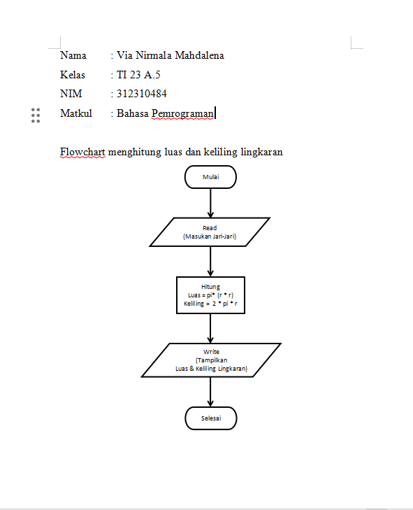

# Praktikum 3

## Flowchartnya 

## menghitung luas dan keliling lingkaran menggunakan Python
# Membuat kode program untuk menghitung luas dan keliling lingkaran
# kode meminta pengguna untuk menginputkan jari jari
    jarijari = float(input("Masukkan jari-jari lingkaran: ")) 

# kode rumus luas lingkaran
    luaslingkaran = 3.14 * jarijari**2  
 
# kode rumus keliling lingkaran
    kelilinglingkaran = 2 * 3.14 * jarijari

# kode untuk menampilkan hasil luas lingkaran
    print("Luas lingkaran adalah: ", luaslingkaran)

# kode untuk menampilkan hasil keliling 
    print("Keliling lingkaran adalah: ", kelilinglingkaran)
# lingkaran

## Maka hasilnya
